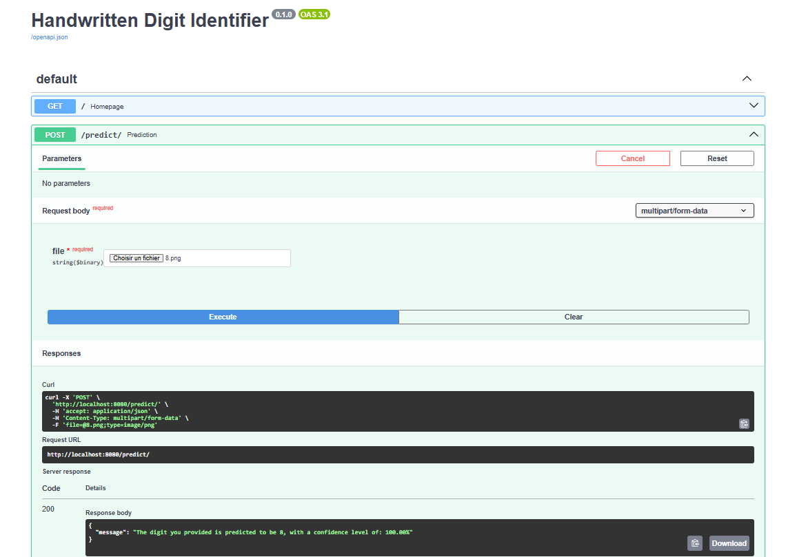

In this project, I built a computer vision model that can recognize handwritten digits.
It's a slightly modified version of the ResNet architecture with little changes:

- The input layer shape is set to (28, 28, 1) to match the MNIST dataset image size (28,28).
- I reduced the number of Residual Blocks down to 5, which makes it a ResNet-12.

As mentioned earlier, I trained the model on the MNIST dataset, and got 98.9% accuracy. 

I then built the API with FastAPI and *Dockerized* it. 

Given an image, it returns a message with the digit in that image and the level of confidence.

If you have Docker installed, you can try it out yourself by following the steps below:

- Step 1:

    You will have to clone this repository:

      git clone https://github.com/Segnaly-2021/CV_Image-Classification.git
- Step 2:
  
    The second step is to build the image. To do so you can pull the corresponding container image from docker Hub:

      docker pull alysegnane/img_classifier_resnet_12:latest
- Step 3:

    Once the image is downloaded, you can run a container out of it. the line below shows how to do that:
  
      docker run --rm -p 8080:8080 alysegnane/img_classifier_resnet_12:latest

- Step 4:

    The server should now be running on your terminal. Leave it there, don't quit the terminal and open your web browser. Navigate to:
  
      http://localhost:8080/docs

    Once there click on the **POST/predict** endpoint on the green bar and more options will become visible.

- Step 5:

    Finally to try the app out click on the **try it out** button in the right corner.
    Submit an image by choosing one from the **images_test** directory. To find it navigate in your local filesystem to find the folder you cloned in **step 1**.
    
    After that, click on execute and let the magic happen!!! 
      
 
